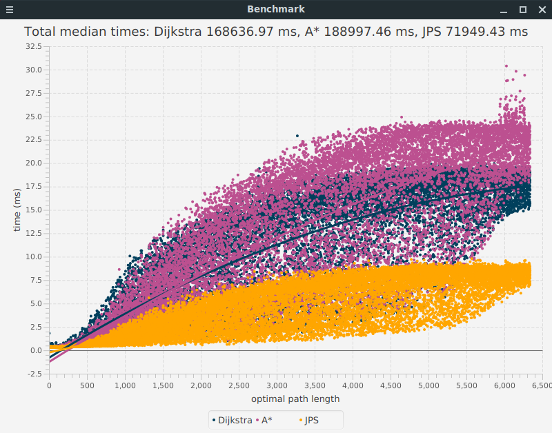
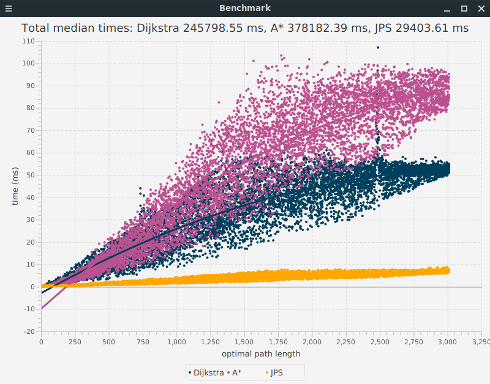
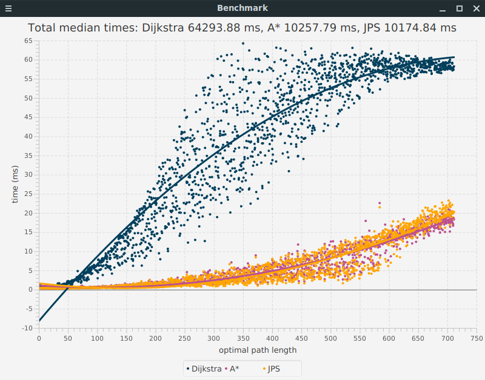
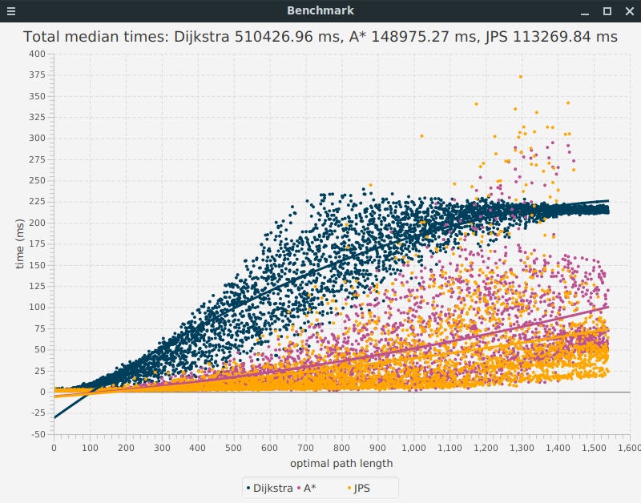
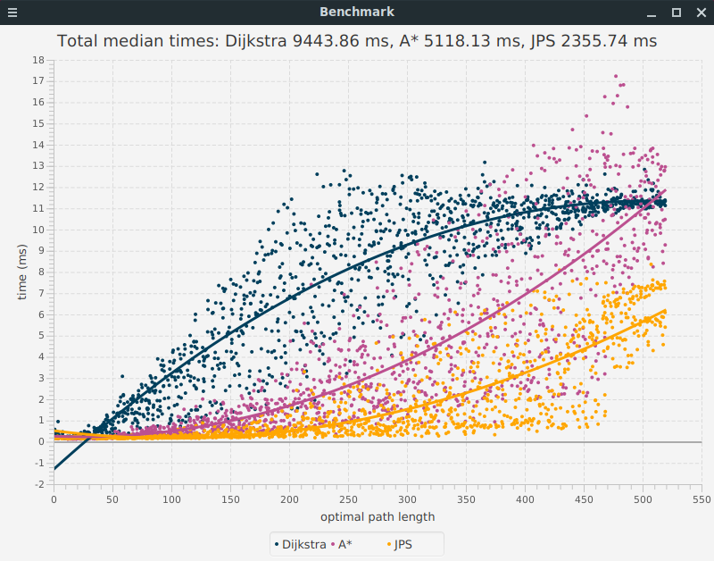

## Testing

### Unit testing

The project contains unit tests implemented with JUnit. The unit tests cover all path-finding algorithms where they are tested on small maps. Binary heap is tested to remove elements in the correct order. Map parser is tested to make sure it parses a map correctly.

On Linux, tests can be ran by heading to /application/ folder and executing the command
```
./gradlew test
```
and code coverage report can be generated with
```
./gradlew jacocoTestReport
```
Code coverage is also available online at [codecov.io](https://codecov.io/gh/tapanih/pathfinding-visualizer).
The user interface related classes defined in package pfvisualizer.ui are not included in the code coverage report.

### Performance testing

The graphical user interface contains a benchmarking utility that can run scenarios defined in a text file that follows Moving AI Labs' scenario file format. A description about the file format can be found [here](https://movingai.com/benchmarks/formats.html). The benchmark utility checks that the path lengths match the optimal lengths stated in the scenario file.

The search is performed 10 times on a single line of the scenario file and the median time is added to the total time. The results are shown below:

| Algorithm | Scenario name         | Map width | Map height | Number of lines | Total median time (ms) |
|:----------|:----------------------|:----------|:-----------|:----------------|:----------------------:|
| Dijkstra  | maze512-1-1.map.scen  | 512       | 512        | 15850           | 168636.97              |
| A*        | maze512-1-1.map.scen  | 512       | 512        | 15850           | 188997.46              |
| JPS       | maze512-1-1.map.scen  | 512       | 512        | 15850           | 71949.43               |
| Dijkstra  | maze512-16-9.map.scen | 512       | 512        | 7530            | 245798.55              |
| A*        | maze512-16-9.map.scen | 512       | 512        | 7530            | 378182.39              |
| JPS       | maze512-16-9.map.scen | 512       | 512        | 7530            | 29403.61               |
| Dijkstra  | random512-10-0.map.scen | 512     | 512        | 1780            | 64293.88               |
| A*        | random512-10-0.map.scen | 512     | 512        | 1780            | 10257.79               |
| JPS       | random512-10-0.map.scen | 512     | 512        | 1780            | 10174.84               |
| Dijkstra  | Berlin_0_1024.map.scen  | 1024    | 1024       | 3850            | 510426.96              |
| A*        | Berlin_0_1024.map.scen  | 1024    | 1024       | 3850            | 148975.27              |
| JPS       | Berlin_0_1024.map.scen  | 1024    | 1024       | 3850            | 113269.84              |
| Dijkstra  | AR0700SR.map.scen       | 320     | 320        | 1300            | 9443.86                |
| A*        | AR0700SR.map.scen       | 320     | 320        | 1300            | 5118.13                |
| JPS       | AR0700SR.map.scen       | 320     | 320        | 1300            | 2355.74                |

The results show that JPS clearly outperforms the other algorithms on all maps. A* algorithm seems to perform poorly on maze-like maps where the heuristic function does not bring much benefits.

The correspondence between the length of optimal path and the running time of algorithms is visualized below:

### maze512-1-1.map.scen



### maze512-16-9.map.scen



### random512-10-0.map.scen



### Berlin_0_1024.map.scen



### AR0700SR.map.scen

